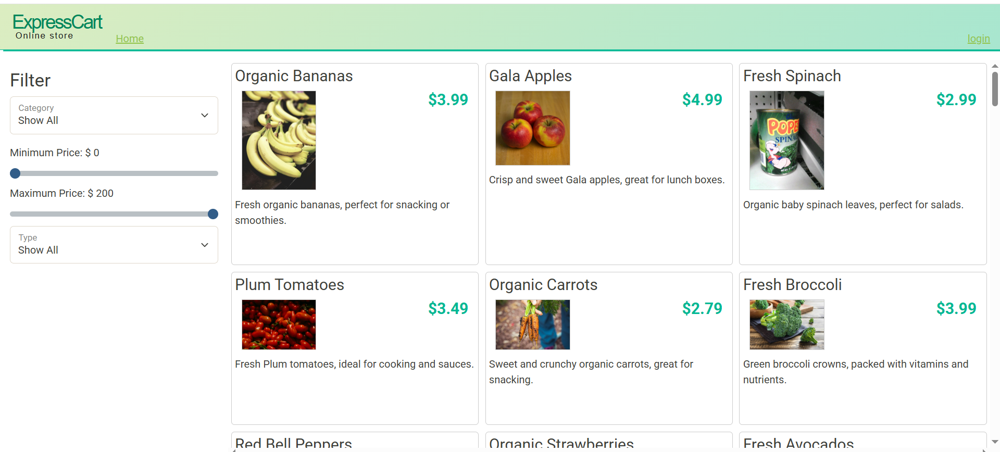

# ExpressCart
An online grocery portal to perform all your food needs
## 🧾 Overview
**ExpressCart** s a full-stack Java-based e-commerce application designed to manage products and shopping carts through a RESTful API and a responsive web interface. The backend is built using Spring Boot, providing secure and scalable APIs, while the frontend delivers a user-friendly web experience. The application uses a database for persistent data storage.
## Features:
- Search by:
  - product category
  - product type
  - price
- Login in to an account
- Add items to the shopping cart
 
***Main screen:***

***Login screen:***

***Shopping cart:***

